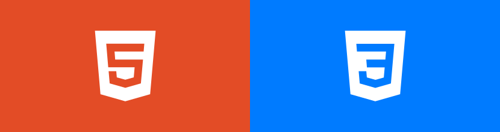

  

  
  
  
  
  
  

## 👋 Welcome to My HTML & CSS Learning Journey!

This repository documents my **daily learning progress** as I build a strong foundation in **HTML** and **CSS**—the core technologies of the web.

My goal is to become a **professional Full-Stack Web Developer**, and this repository represents the first and most important step in that journey.

Along the way, I’ve also explored:

- CSS preprocessors like **Sass**
- CSS frameworks such as **Bootstrap** and **Tailwind CSS**
- Modern layout techniques (**Flexbox** & **CSS Grid**)
- Advanced animations using **GSAP**

## learnig resources:

Here are some of the main resources I use:

- **Bearmentor**
- [Learn modern HTML5, CSS3 and web design by building a stunning website for your portfolio! Includes flexbox and CSS Grid](https://www.udemy.com/course/design-and-develop-a-killer-website-with-html5-and-css3/?couponCode=CP251129CMG4)
- [Advanced CSS and Sass: Flexbox, Grid, Animations and More!](https://www.udemy.com/course/advanced-css-and-sass/)

## My Motivation

I am studying HTML & CSS because I want to:

- Write **clean, semantic, and professional HTML**
- Create **modern, responsive, and visually appealing UI designs**
- Build a **strong foundational skillset** for long-term growth
- Prepare myself for advanced frontend and backend technologies

## Long-Term Goals

Through this learning journey, I aim to:

- Develop a **deep and structured understanding** of HTML & CSS
- Write markup that follows **industry best practices**
- Master modern layouts using **Flexbox** and **CSS Grid**
- Build smooth and meaningful **CSS & GSAP animations**
- Create fully **responsive and accessible** websites
- Use frameworks like **Bootstrap** and **Tailwind CSS** for productivity
- Prepare myself to move confidently into **JavaScript & backend development**

## Repository of project

Some projects built during this journey:

- 🌐 **Personal Website**  
   [burhanudin.com](https://github.com/burhanudinrabbani666/burhanudin.com)

- 🍔 **Omnifood Landing Page**  
   [Omnifood Project](https://github.com/burhanudinrabbani666/html-css-omnifood-project)

- 🖼️ **Natours Website**  
   [Natours Project](https://github.com/burhanudinrabbani666/natorus)

## 🏁 Thanks

This repository focuses **exclusively on HTML and CSS** (no JavaScript yet).  
I continuously update it as my skills grow and my understanding deepens.

My ultimate goal is to become a **solid Full-Stack Developer**, starting with a **rock-solid foundation in HTML & CSS**.

Thanks for checking out my learning journey! 🚀
